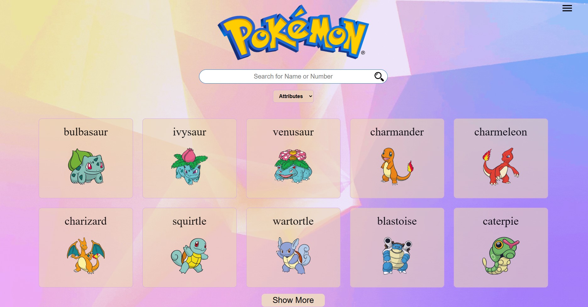
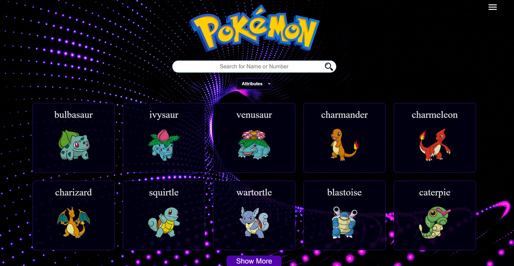
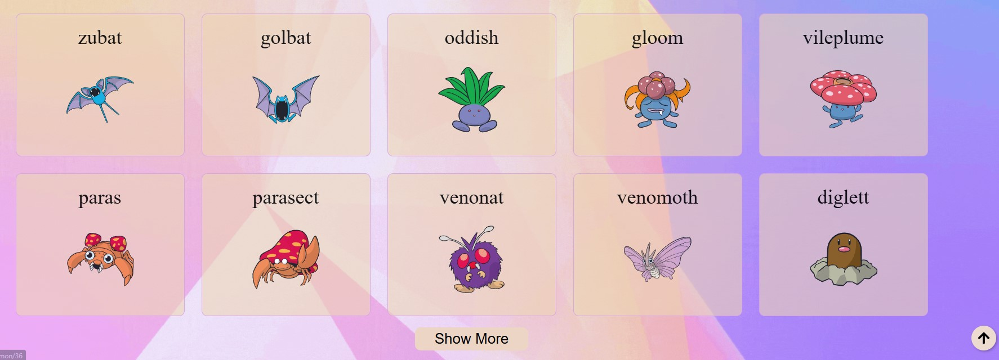
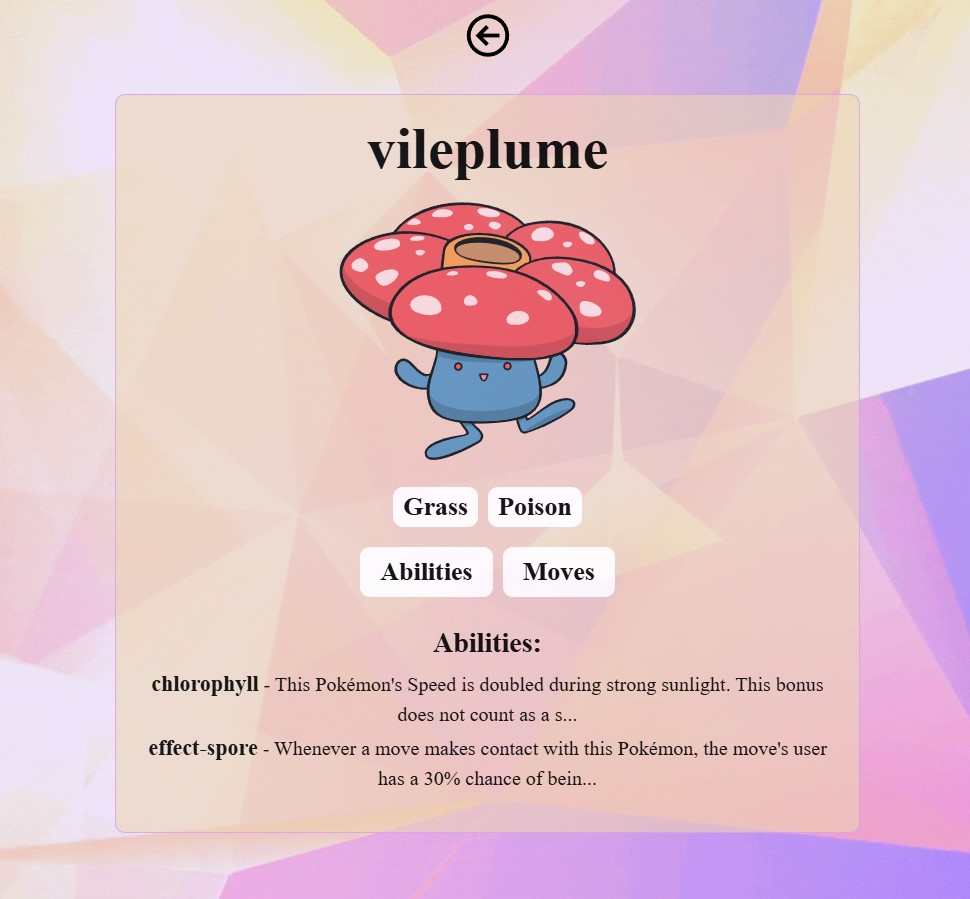
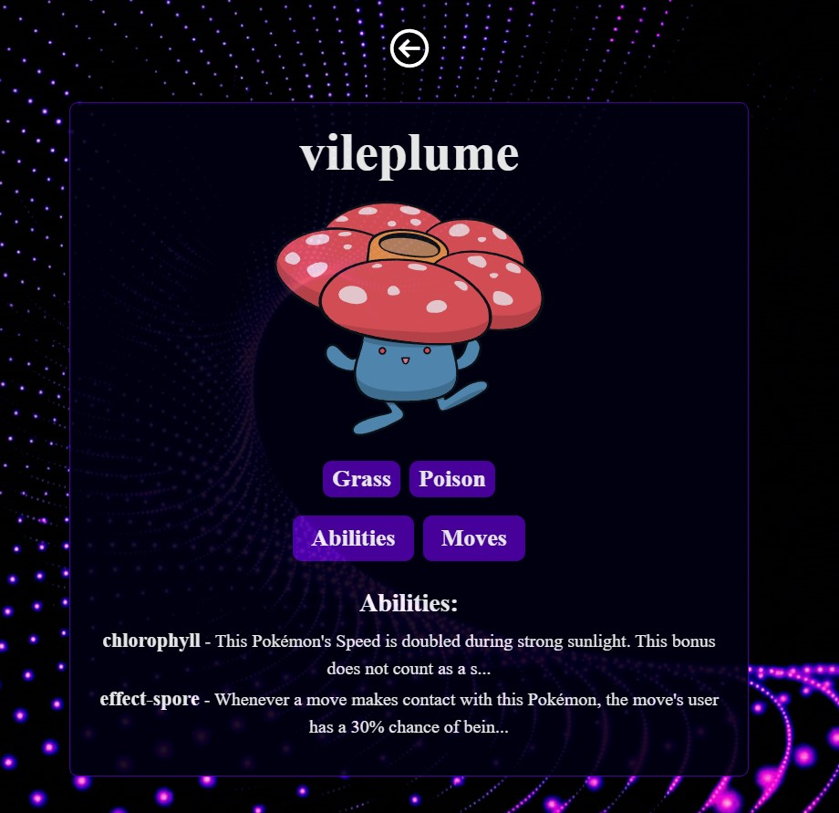
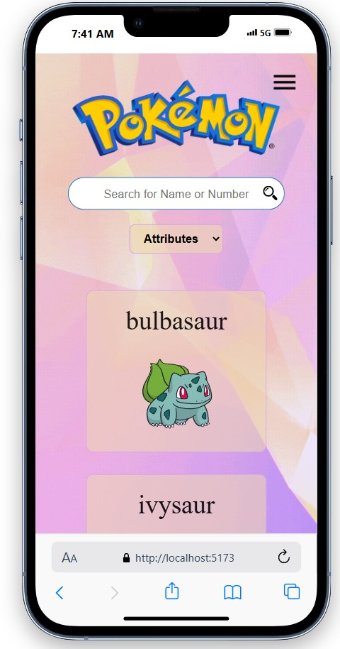
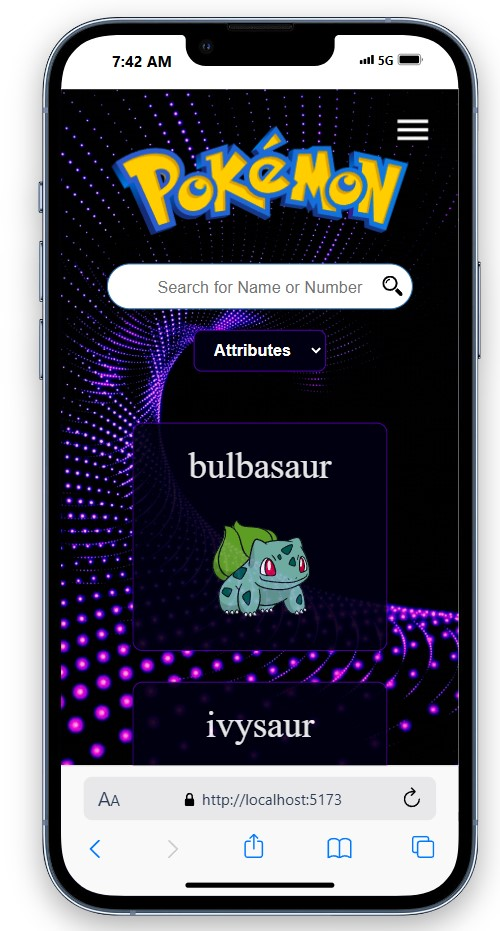
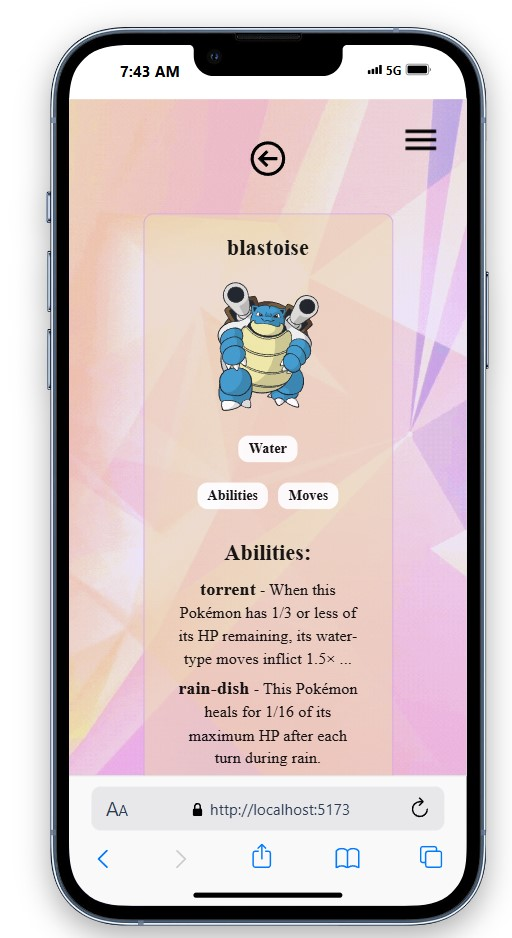
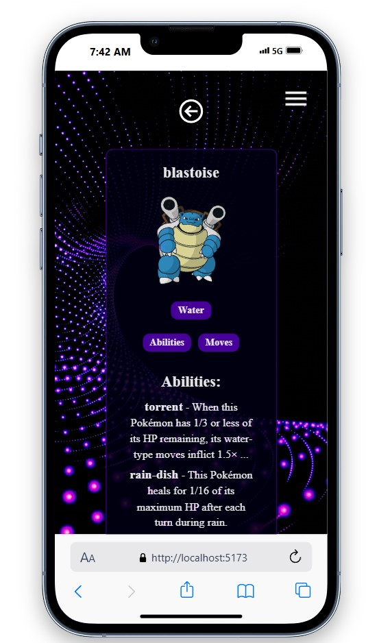

# Desafio com API Pokemom

<br>

## Aventure-se em um reino encantado de códigos e criaturas mágicas! 🌌✨🐉🧝‍♂️

<br>
<br>

# Descrição do Projeto


Este é um projeto Pokedex desenvolvido em React.js, utilizando Material UI e React Icons. O projeto é responsivo para todas as telas e aplica conceitos de pensamento computacional para solução de problemas. As funcionalidades incluem tradução dos componentes, filtro de busca de Pokemons, temas claro e escuro, botão de música e menu hambúrguer. O projeto busca Pokemons, lista movimentos e habilidades, e pode filtrar por atributos. Utiliza a API dos Pokemons para buscar informações detalhadas.

<br>
<br>

# Funcionalidades

 Responsividade: Interface adaptada para todas as telas.

Internacionalização: Tradução dos componentes para diferentes idiomas.

 Filtro de Busca: Busca de Pokemons por nome ou atributos.

 Temas Claro e Escuro: Alternância entre temas claro e escuro.

 Botão de Música: Música de fundo para uma experiência mais imersiva.

 Menu Hambúrguer: Navegação fácil e intuitiva.

 <br>

 # Visualização do Projeto
 
# Project Preview












<br>

 # Tecnologias Utilizadas
React.js

Material UI

React Icons

Axios (Para requisições à API)

React Router (Para navegação entre páginas)

i18n (Para internacionalização)

API dos Pokemons


## Como utilizar

Clone este repositório

Instale as dependências com `npm install`

Execute o projeto com `npm run dev`


```

                        ## Sua Opinião Importa

Se você explorou o projeto e tem alguma observação, sugestão ou apenas deseja entrar em contato, por favor, compartilhe conosco. Valorizamos muito o seu feedback e estamos constantemente em busca de melhorias. Seu insight é essencial para aprimorar nosso projeto. Não hesite em nos contatar, mesmo que seja apenas para dizer "oi". Aguardamos ansiosamente seu contato e agradecemos sua participação em nossa jornada.


